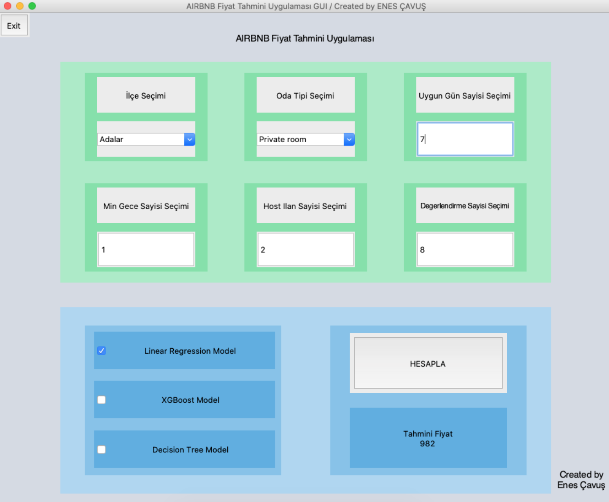

### Data Science Projects

***

# ROADMAP 

___Machine Learning Projects___

    - This folder includes my end-to-end machine learning projects and some similar practices.
    - Understanding of machine learning models - Regression, SVM, Decision Trees, Random Forest, SVM
    - Exploring data with visualization libraries
    - Traning models with different approaches - GridSearch and similar optimizations
    - Model deployments and GUI integrations
    - Overall: ML, DL, Data Analysis, Visualization, Deployment, Optimization, Integration

___Some Screenshots From My ML Projects___

---

---

---

---

---

---

---

---

---

---

---

---

---

---

---

---

___ENES ÇAVUŞ - Machine Learning Projects___

___Contact:___ [LinkedIn](https://www.linkedin.com/in/enes-çavuş-057376175)
